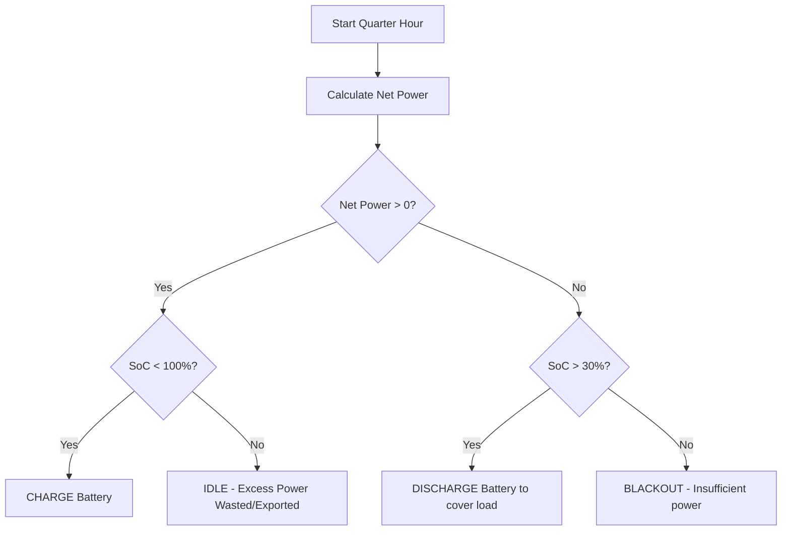

# Renewable Energy Microgrid Battery Scheduler ☀️🔋

A high-fidelity **24-hour simulation system** developed as the final project for the **Fundamentals of Programming (FoCP) - Fall 2025** course. The application models, schedules, and optimizes energy distribution and storage dynamics in a solar-powered microgrid.

---

## 📋 Project Overview

In clean energy engineering, balancing unpredictable renewable generation with volatile load demand is a major challenge. This software simulates a microgrid operating with a **2220 Wh (180 Ah @ 12V)** deep-cycle battery and a domestic/commercial load consisting of **5 appliances**. 

By evaluating energy states at **15-minute (quarter-hourly) resolution** (96 intervals per day), the scheduler manages charging, discharging, and reserve boundaries to achieve maximum grid uptime and prevent blackouts.

---

## ⚡ Technical Specifications

| Parameter | Specification | Description |
| :--- | :--- | :--- |
| **Battery Capacity** | 2220 Wh (180 Ah @ 12V) | Models a standard deep-cycle lead-acid/lithium energy storage bank. |
| **Reserve Threshold** | 30.0% SoC | Minimum charge level to preserve battery health and prevent deep discharge. |
| **Simulated Duration** | 24 Hours | Complete diurnal cycle. |
| **Simulation Step** | 15-minute intervals | 4 intervals/hour (96 total checkpoints) for high-accuracy behavior modeling. |
| **Appliance Profiles** | 5 Devices | Simultaneously tracks and accumulates demands from 5 distinct sources. |

---

## 🧠 Controller Decision Logic

At every simulation step, the controller evaluates the net power balance:
$$\text{Net Power} = \text{Solar Generation} - \text{Total Demand}$$

The microgrid system then transitions into one of four operational states based on energy availability and battery levels:



1. **CHARGE** 🟢: Surplus solar energy ($\text{Net Power} > 0$) is directed to the battery (capped at 100.0% SoC).
2. **DISCHARGE** 🔵: Battery supplies power to cover the generation deficit ($\text{Net Power} < 0$), provided the SoC remains above the 30.0% safety limit.
3. **BLACKOUT** 🔴: Occurs when solar power is insufficient and the battery is depleted ($\le 30.0\%$ SoC). The grid fails to support the load during this quarter-hour.
4. **IDLE** 🟡: Perfect equilibrium between generation and load, or the battery is fully charged (100.0%) during a solar surplus.

---

## 📂 Repository File Structure

- **`microgrid_optimiser.cpp`**: Main C++ program containing core simulation loops, array structures, file handling, and decision matrices.
- **`solar_input.txt`**: Configuration file carrying solar irradiance curves and base load profiles.
- **`simulation_report.txt`**: Tabular text output containing 15-minute transaction logs generated by the simulator.
- **`design.txt`**: Preliminary algorithmic architecture and state-logic designs.
- **`README.md`**: Modern documentation page for GitHub.

---

## 🛠️ Compilation & Execution

This program is written in standard, portable C++ and requires no third-party libraries. You can compile and run it using any standard C++ compiler (such as GCC/G++).

### 1. Compile the source code
```bash
g++ -O3 microgrid_optimiser.cpp -o microgrid_optimiser
```

### 2. Prepare the input data (`solar_input.txt`)
Make sure your directory contains `solar_input.txt` with:
- **Line 1**: 24 space-separated floating-point values representing solar production (Watts) per hour.
- **Line 2**: 5 space-separated integer values representing base load values (Watts) for the 5 appliances.

### 3. Run the executable
- **Windows**:
  ```powershell
  .\microgrid_optimiser.exe
  ```
- **macOS / Linux**:
  ```bash
  ./microgrid_optimiser
  ```

---

## 📊 Sample Output & Simulation Analytics

Upon execution, the scheduler generates a report similar to the following:

```text
=== MICROGRID 24-HOUR SIMULATION ===

Time       Solar(W)   Load(W)    Net(W)     Action       SOC(%)
---------------------------------------------------------------
 0: 0         0.0     72.5    -72.5   BLACKOUT    30.0%
 ...
 7: 0       220.0     72.5    147.5   CHARGE      31.7%
 7:15       220.0     72.5    147.5   CHARGE      33.3%
 ...
14:30       322.5     72.5    250.0   CHARGE     100.0%
14:45       322.5     72.5    250.0   IDLE       100.0%
 ...
20: 0        50.0     72.5    -22.5   DISCHARGE   99.7%
---------------------------------------------------------------
Simulation complete!
Final battery level: 97.0%
Uptime: 17 out of 24 hours
Blackouts occurred in 7 hours.
```

---

### 🎓 Academic Information
- **Course**: Fundamentals of Programming (FoCP)
- **Institution**: NUST (National University of Sciences and Technology)
- **Student Name**: Muhammad Mohsin
- **Student Registration ID**: 540446
